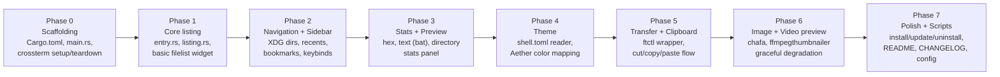

# TUI File Manager: Build Plan

> **Status**: Pre-implementation. This document is the agreed-upon spec. No code has been written.
> Update this file whenever features change before touching source.

---

## Resolved Decisions

| # | Question | Decision |
|---|---|---|
| 1 | Binary name | `fim` |
| 2 | GitHub repo name | `tui-file-manager` (confirmed) |
| 3 | chafa install | `install.sh` pulls it automatically via `pacman -S --noconfirm chafa` |
| 4 | Work sidebar path | `$HOME/Work`, auto-detected at runtime, hidden from sidebar if the dir does not exist |

---

## 1. Project Overview

A keyboard-driven, terminal-native file manager for Arch-based systems (Omarchy and similar), written in Rust. All file copy/move operations are delegated exclusively to the **file-transfer plugin** (`ftctl`/`filetransferd`), so every transfer is visible and controllable from the Quickshell Transfer Manager panel.

**Design philosophy:**
- Zero hardcoded paths, usernames, or filesystem assumptions. Everything resolves from XDG env vars or sensible XDG-compliant fallbacks at runtime.
- Graceful per-section degradation: a preview failure or a missing optional tool (chafa, ffmpegthumbnailer) never kills the rest of the UI.
- Omarchy Aether theme integration: colors read live from `$XDG_CONFIG_HOME/omarchy/shell.toml` (the Aether-generated file) and applied as true-color to every UI surface.
- "Not installed" vs "permission denied" are always distinguished in error messages.
- No `shell=true` subprocess calls anywhere; every external tool is called with an explicit argv list and resolved absolute path.

---

## 2. Tech Stack

| Layer | Choice | Rationale |
|---|---|---|
| Language | Rust (stable, 1.80+) | Zero runtime deps, native perf, good curses-level terminal control |
| TUI framework | [`ratatui`](https://ratatui.rs) + [`crossterm`](https://github.com/crossterm-rs/crossterm) | Active, production-quality; crossterm gives true-color + mouse on Linux |
| TOML parsing | [`toml`](https://crates.io/crates/toml) | Reads Omarchy `colors.toml` / `config.toml` |
| Serde | [`serde`](https://serde.rs) + `serde_json` | Recents persistence, ftctl JSON parsing |
| Mime detection | [`mime_guess`](https://crates.io/crates/mime_guess) + system `file` binary | Fast extension lookup, fall back to `file --mime-type` for ambiguous cases |
| Scripting | Bash | `install.sh`, `update.sh`, `uninstall.sh` |

**No Python runtime dependency.** The transfer daemon (`filetransferd`) is a separate project; we only shell out to the `ftctl` binary.

---

## 3. Layout

```
┌─ Sidebar ─────────┬─ File List ─────────────────────────┬─ Preview + Stats ──────────────────┐
│                   │                                      │                                     │
│  [Home]           │  ../ (parent)                        │  ╔═ Preview ════════════════════╗   │
│  [Documents]      │  > dir/                              │  ║                               ║  │
│  [Pictures]       │    file.rs            3.2K  2h ago   │  ║  image / text / hex dump     ║  │
│  [Videos]         │    archive.tar.gz    14.1M  3d ago   │  ║  rendered inline here         ║  │
│  [Work]           │    document.pdf       1.1M  today    │  ║                               ║  │
│  [Recents]        │                                      │  ╚═══════════════════════════════╝  │
│  ─────────        │                                      │                                     │
│  [Bookmarks]      │                                      │  ─── Stats ──────────────────────   │
│                   │                                      │  Name     document.pdf              │
│                   │                                      │  Size     1.1 MiB (1,154,048 B)     │
│                   │                                      │  MIME     application/pdf            │
│                   │                                      │  Mode     -rw-r--r--                 │
│                   │                                      │  Owner    user:group                 │
│                   │                                      │  Modified 2026-09-20 14:32           │
│                   │                                      │  Created  2026-09-18 09:11           │
│                   │                                      │  Inode    2097664                    │
│                   │                                      │  Links    1                          │
├───────────────────┴──────────────────────────────────────┴─────────────────────────────────────┤
│ [c]opy  [m]ove  [d]trash  [D]delete  [r]ename  [n]ewdir  [t]ouch  [/]search  [?]help  [q]quit  │
└─────────────────────────────────────────────────────────────────────────────────────────────────┘
```

**Panel proportions (configurable in `config.toml`):**
- Sidebar: 18% width, min 16 columns
- File list: 46% width
- Preview+Stats: 36% width

---

## 4. Feature Set

### 4.1 Navigation

| Action | Key |
|---|---|
| Move cursor up/down | `j` / `k` or arrow keys |
| Enter directory | `l` or `Enter` |
| Go to parent | `h` or `Backspace` |
| Jump to sidebar section | `1`-`7` or click |
| Go to home | `~` |
| Go to root | `/` (when in navigation mode) |
| Toggle hidden files | `.` |
| Sort cycle (name/size/mtime/type) | `s` |
| Sort reverse | `S` |
| Search/filter | `/` (opens inline prompt) |
| Jump to path (type-ahead) | `g` then path prompt |
| Open in `$EDITOR` | `e` |
| Open with `xdg-open` | `o` |
| Refresh listing | `R` or `F5` |
| Quit | `q` / `Ctrl+C` |

### 4.2 Selection and Clipboard

| Action | Key |
|---|---|
| Toggle single selection | `Space` |
| Select all visible | `a` |
| Clear selection | `Escape` |
| Copy selection to clipboard | `c` |
| Cut (move) selection to clipboard | `x` |
| Paste to current dir (via ftctl) | `p` |
| Show clipboard contents | `P` |

**All paste operations go through `ftctl enqueue`**. There is no in-process `std::fs::copy` or `std::fs::rename` for cross-directory transfers.

### 4.3 File Operations

| Action | Key | Notes |
|---|---|---|
| Trash (trash-cli) | `d` | Graceful error if trash-cli not installed |
| Permanent delete (confirm prompt) | `D` (shift+d) | Double-confirm with typed "yes" |
| Rename | `r` | Inline editor in status bar |
| New directory | `n` | Inline prompt |
| New file (touch) | `t` | Inline prompt |
| Symbolic link | `L` | Prompts for target, then name |

### 4.4 Preview Panel

Preview renders in the right panel **beside stats**, not replacing them. Stats are always shown below the preview.

| Content type | Tool | Fallback |
|---|---|---|
| Text / source code | `bat --color=always --paging=never` via subprocess, ANSI stripped to ratatui spans | Plain `cat` first 200 lines |
| Images (PNG, JPG, AVIF, etc.) | `chafa` (optional dep) | ASCII art via `chafa` fallback mode or "preview unavailable" if chafa absent |
| Video (MP4, MKV, etc.) | `ffmpegthumbnailer` -> temp PNG -> `chafa` | "no thumbnail" message if either missing |
| PDF | `pdftotext -l 1` (first page as text) | Hex header if pdftotext absent |
| Binary / unknown | First 512 bytes rendered as hex dump (built-in, no external tool needed) | Always works |
| Directory | Item count, total size (du), newest mtime | Always works |
| Broken symlink | Shows link target, "target not found" warning | Always works |

Preview is computed in a background thread (bounded channel, max 1 pending preview at a time) so scrolling the list never blocks on a slow preview.

**Image preview approach:** `chafa` is called with `--size=WxH` matching the panel dimensions, `--colors=full` if the terminal reports `$COLORTERM=truecolor`, else `--colors=256`. Output is plain UTF-8 with ANSI escapes, parsed and rendered via ratatui's `Line`/`Span` API.

### 4.5 Sidebar Sections

Resolved at runtime, never hardcoded:

| Section | Resolution |
|---|---|
| Home | `$HOME` |
| Documents | `$XDG_DOCUMENTS_DIR` (from `~/.config/user-dirs.dirs`), fallback `$HOME/Documents` |
| Downloads | `$XDG_DOWNLOAD_DIR` (from `~/.config/user-dirs.dirs`), fallback `$HOME/Downloads` |
| Pictures | `$XDG_PICTURES_DIR`, fallback `$HOME/Pictures` |
| Videos | `$XDG_VIDEOS_DIR`, fallback `$HOME/Videos` |
| Work | Config `[bookmarks]` `work_dir`, fallback `$HOME/Work` if it exists, else hidden |
| Recents | Last 50 unique visited paths, persisted to `$XDG_STATE_HOME/tui-fm/recents.json` |
| Bookmarks | User-defined entries in `$XDG_CONFIG_HOME/tui-fm/config.toml` |

XDG user dirs are parsed from the file at `$XDG_CONFIG_HOME/user-dirs.dirs` (or `$HOME/.config/user-dirs.dirs` as fallback), not hardcoded.

### 4.6 Theme Integration (Aether / Omarchy)

On startup, the theme loader:

1. Reads `$XDG_CONFIG_HOME/omarchy/shell.toml` (the Aether-generated live theme file).
2. Parses the hex color fields (`accent`, `foreground`, `background`, `muted`, `selection`, `red`, `green`, etc.) as `Color::Rgb(r,g,b)` in ratatui.
3. If the file is absent (non-Omarchy system), falls back to a built-in safe palette defined in `src/theme/fallback.rs` - no error, no crash.
4. Theme colors are re-read on `SIGUSR1` (so `omarchy theme set <name>` can be wired up to hot-reload).

Color role mapping:

| UI Role | Aether key |
|---|---|
| Normal text | `foreground` |
| Dim/metadata | `muted` |
| Selected item bg | `selection` |
| Selected item fg | `bright_foreground` |
| Accent / focus border | `accent` |
| Directory entries | `green` |
| Symlinks | `cyan` |
| Broken symlinks | `red` |
| Executable files | `yellow` |
| Preview border | `accent` |
| Status bar bg | `darker_background` |
| Error messages | `red` |
| Panel background | `background` |

### 4.7 File Stats Panel

Always shown below the preview. For the focused entry:

- **Name** (plain text, no markup injection)
- **Size** (human-readable + exact bytes)
- **MIME type** (via `mime_guess`, confirmed with `file --mime-type` if ambiguous)
- **Mode** (rwxrwxrwx string + octal)
- **Owner** (`user:group`, numeric fallback if lookup fails)
- **Modified** (ISO 8601 local time)
- **Accessed** (ISO 8601 local time)
- **Created / Birth** (if available on the FS, `statx` on Linux 4.11+)
- **Inode number**
- **Hard link count**
- **On-disk blocks** (512-byte blocks as reported by `st_blocks`)
- **Symlink target** (if a symlink, shows resolved path; "broken" if not found)
- **Transfer daemon status** - if a job involving this file exists in the ftctl queue, shows job state inline (running / queued / paused)

---

## 5. Project Structure

```
tui-file-manager/
├── Cargo.toml
├── Cargo.lock
├── src/
│   ├── main.rs                  # Entry point, args, terminal setup/teardown
│   ├── app.rs                   # Top-level App state machine
│   ├── ui/
│   │   ├── mod.rs
│   │   ├── layout.rs            # Panel sizing, responsive splits
│   │   ├── sidebar.rs           # Sidebar widget
│   │   ├── filelist.rs          # File list widget
│   │   ├── preview.rs           # Preview + stats combined widget
│   │   ├── statusbar.rs         # Bottom bar: keybinds + messages
│   │   └── prompt.rs            # Inline input prompts (rename, mkdir, etc.)
│   ├── core/
│   │   ├── mod.rs
│   │   ├── entry.rs             # DirEntry wrapper with metadata
│   │   ├── listing.rs           # Directory reading + sorting + filtering
│   │   ├── clipboard.rs         # Cut/copy state
│   │   ├── recents.rs           # Recent paths, persisted JSON
│   │   ├── bookmarks.rs         # XDG dirs + user bookmarks
│   │   └── transfer.rs          # ftctl subprocess wrapper (enqueue, list)
│   ├── fs/
│   │   ├── mod.rs
│   │   ├── ops.rs               # rename, mkdir, touch, delete, trash
│   │   ├── mime.rs              # MIME detection (mime_guess + `file` binary)
│   │   └── xdg.rs               # XDG dir resolution (user-dirs.dirs parser)
│   ├── preview/
│   │   ├── mod.rs               # Preview dispatcher, background thread
│   │   ├── text.rs              # bat / plain text renderer
│   │   ├── image.rs             # chafa image renderer
│   │   ├── video.rs             # ffmpegthumbnailer + chafa
│   │   ├── pdf.rs               # pdftotext renderer
│   │   ├── hex.rs               # Built-in hex dump (no deps)
│   │   └── directory.rs         # Directory summary preview
│   ├── theme/
│   │   ├── mod.rs               # Theme struct, loader, SIGUSR1 hot-reload
│   │   ├── aether.rs            # shell.toml parser -> Theme
│   │   └── fallback.rs          # Built-in safe palette (non-Omarchy systems)
│   └── config/
│       ├── mod.rs               # Config struct
│       └── loader.rs            # XDG_CONFIG_HOME/tui-fm/config.toml parser
├── install.sh                   # Build release binary, install to ~/.local/bin
├── update.sh                    # git pull --ff-only, re-run install.sh
├── uninstall.sh                 # Remove binary and state, prompt before each step
├── README.md
├── CHANGELOG.md
└── LICENSE                      # MIT
```

---

## 6. Configuration (`config.toml`)

Located at `$XDG_CONFIG_HOME/tui-fm/config.toml`. Created with defaults on first run.

```toml
# tui-fm configuration
# All paths support $HOME and XDG variables; never hardcode absolute paths here.

[ui]
show_hidden      = false
sort_key         = "name"    # name | size | mtime | type
sort_reverse     = false
sidebar_width    = 18        # percent
preview_width    = 36        # percent

[preview]
enabled          = true
max_text_lines   = 200
max_binary_bytes = 512
image_renderer   = "auto"   # auto | chafa | none
video_thumbs     = true     # requires ffmpegthumbnailer + chafa

[theme]
source           = "auto"   # auto (Omarchy shell.toml) | path | builtin
# path           = "$XDG_CONFIG_HOME/omarchy/shell.toml"  # override

[bookmarks]
# work_dir = "$HOME/Work"  # uncomment to override; omitted = auto-detected

[[bookmarks.custom]]
name = "Projects"
path = "$HOME/Projects"

[transfer]
# ftctl_path = "$HOME/.local/bin/ftctl"  # override if not in default location

[recents]
max_entries = 50
```

---

## 7. Transfer Integration

**Rule:** copy and move are never performed in-process. The only transfer path is:

```
user presses c/x then p
  -> clipboard.rs builds source list
  -> transfer.rs calls: [ftctl_path, "enqueue", "--copy"|"--move", dest, "--", ...sources]
  -> captures JSON response, extracts job id
  -> shows status in status bar
  -> Quickshell Transfer Manager panel picks up the job automatically
```

`ftctl_path` is resolved in this order:
1. `$TFM_FTCTL_PATH` environment variable
2. `[transfer] ftctl_path` from `config.toml`
3. `$HOME/.local/bin/ftctl` (file-transfer plugin default install location)
4. `which ftctl` / `$PATH` lookup

If none found: a clear "ftctl not found" error is shown with install instructions. No silent fallback to `std::fs::copy`.

---

## 8. Scripts

### `install.sh`
1. Check for `cargo` (required), `rustc >= 1.80` (required).
2. `cargo build --release`
3. Install binary to `$INSTALL_DIR` (default `$HOME/.local/bin`, override-able by env).
4. Create `$XDG_CONFIG_HOME/tui-fm/config.toml` with defaults if not already present.
5. Install optional completions to `$XDG_DATA_HOME/bash-completion/completions/` and `$XDG_DATA_HOME/zsh/site-functions/`.
6. All writes are tagged; never overwrites files it didn't create, without asking.
7. Reports "not detected" for optional deps (chafa, ffmpegthumbnailer, trash-cli) with `pacman -S <pkg>` install hint.

### `update.sh`
1. `git pull --ff-only` (does NOT silently pull a moving branch - user does the pull, update.sh applies it).
2. Re-runs `install.sh`.
3. Accepts `--yes` / `-y` to skip confirmation prompts.

### `uninstall.sh`
1. Removes binary from `$INSTALL_DIR`.
2. Optionally removes `$XDG_CONFIG_HOME/tui-fm/` (asks first).
3. Optionally removes `$XDG_STATE_HOME/tui-fm/` (recents, cache) (asks first).
4. Never removes anything it doesn't recognise (checks for a marker comment before deleting).
5. Accepts `--yes` / `-y`.

---

## 9. Security Checklist (per global rules)

| Category | Mitigation |
|---|---|
| **File integrity / TOCTOU** | Never follow symlinks on sensitive stat ops (use `std::fs::symlink_metadata`). Paths from user input are validated (no null bytes, no `../` escape past root). |
| **Subprocess / RCE** | All external tool calls use `std::process::Command` with explicit argv. No `shell=true`, no string concatenation. Binary paths are resolved absolute before use, not $PATH-searched at call time. |
| **Serialization** | `recents.json` is bounded (max 50 entries, each path capped at 4096 bytes). Parsed with `serde_json`; `colors.toml` parsed with `toml`. No `eval`, no `pickle`. |
| **Encoding / markup injection** | All file names rendered as `ratatui::text::Span` plain text, never interpolated into ANSI escape strings or format strings. |
| **Hashing** | No custom hashing. Inode identity used where needed. |
| **Authentication** | Reads no credential files. Requests no elevated privilege. |
| **Data handling** | Preview text capped at `max_text_lines` (default 200). Binary preview capped at `max_binary_bytes` (default 512). `ftctl list` response capped at a reasonable byte budget before JSON parse. |
| **Permissions** | Distinguishes `PermissionError` (present but denied) from `FileNotFoundError` (absent) in every listing and stat call. |
| **Lock contention** | Does not invoke `systemctl` for daemon status checks. Uses `ftctl list` (read-only) to poll transfer state. |

---

## 10. Implementation Phases



Each phase is independently buildable and runnable. Phase 0 through 5 require no optional system tools. Phase 6 requires chafa (optional) and ffmpegthumbnailer (optional).

---

## 11. Crate Dependencies (`Cargo.toml`)

```toml
[dependencies]
ratatui     = "0.28"
crossterm   = { version = "0.28", features = ["event-stream"] }
toml        = { version = "0.8", features = ["parse"] }
serde       = { version = "1", features = ["derive"] }
serde_json  = "1"
mime_guess  = "2"
dirs        = "5"       # XDG-aware home/config/data/state dir resolution

[dev-dependencies]
tempfile    = "3"

[build-dependencies]
serde_json  = "1"        # build.rs reads meta.json, the project's name/version source of truth
```

No build-time C dependency beyond the Rust standard library. All crates are pure Rust or use only the Rust standard library's OS bindings.
