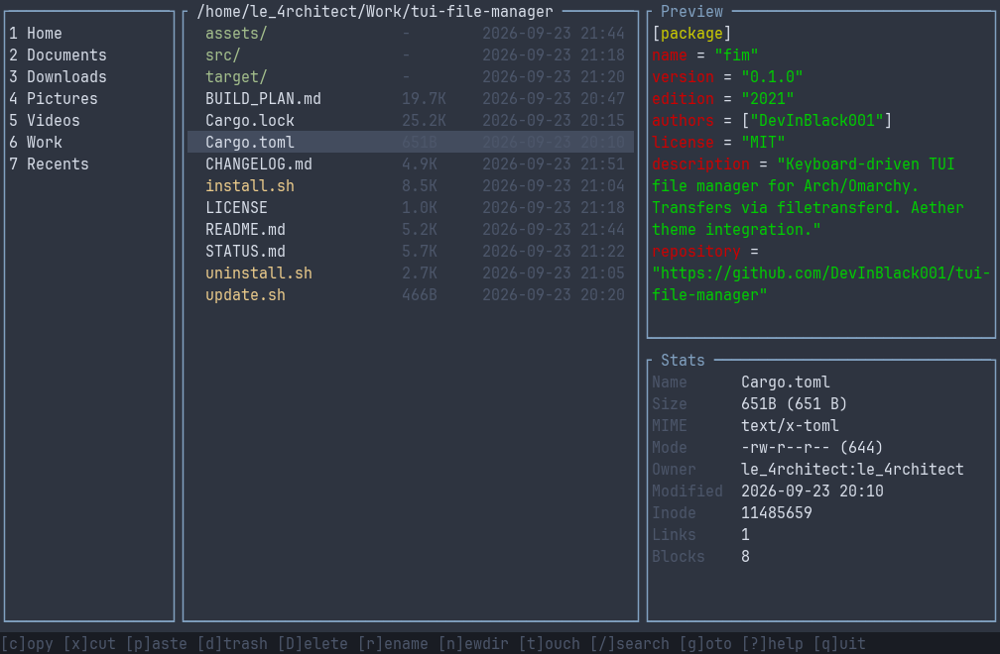

# fim

A keyboard-driven, terminal-native file manager for Arch-based systems (Omarchy and similar), written in Rust.

All file copy and move operations are delegated to the [file-transfer plugin](https://github.com/DevInBlack001/omarchy-transfer-manager) (`ftctl` / `filetransferd`), so every transfer runs asynchronously and stays visible and controllable from the Quickshell Transfer Manager panel.



## Features

- Three-pane layout: sidebar (Home, Documents, Downloads, Pictures, Videos, Work, Recents, plus user bookmarks), file list, and a combined preview + stats panel.
- Live Omarchy theme integration: colors are read from the currently active Omarchy theme (`$XDG_STATE_HOME/omarchy/current/theme/colors.toml`) and re-applied on demand with `R`. Falls back to a built-in dark palette on any non-Omarchy system.
- Rich previews: syntax-highlighted text (via `bat`, with a plain-text fallback), real image/video previews via the Kitty graphics protocol or Sixel graphics (falling back to colorized character art via `chafa` on other terminals), PDF first-page text (via `pdftotext`), a built-in hex dump for unknown binaries, and hand-drawn ASCII glyphs for disc images, archives, `.torrent` files, and OpenDocument/Microsoft Office documents. `.ovpn` files always show the VPN glyph and never their content, since they commonly embed credentials.
- Full file stats panel: size, MIME type, permissions, owner, timestamps, inode, link count, symlink target, and live transfer-job status when a file is queued in `ftctl`.
- Selection, clipboard (copy/cut/paste, always via `ftctl`), trash (via `trash-cli`), permanent delete with a typed confirmation, rename, mkdir, touch, and symlink creation.
- Search/filter, sort by name/size/mtime/type, hidden-file toggle, and a "goto path" prompt.
- Open the focused file in `nvim` by default (offers to install it if missing, falling back to `$EDITOR` otherwise), via `xdg-open`, or via an arbitrary "open with" command.
- Every external tool is invoked with an explicit argument list and a resolved absolute path; nothing is ever run through a shell.

## Requirements

- Rust (stable, 1.80+) to build.
- [`ftctl` / `filetransferd`](https://github.com/DevInBlack001/omarchy-transfer-manager) for copy/move/paste. `install.sh` offers to install it for you.

Optional, for richer previews (checked and reported by `install.sh`):

- `chafa` for image previews (installed automatically via `pacman` if missing).
- `ffmpegthumbnailer` for video thumbnails.
- `bat` for syntax-highlighted text previews.
- `trash-cli` for the trash (`d`) action.

## Installation

```sh
git clone https://github.com/DevInBlack001/tui-file-manager.git
cd tui-file-manager
./install.sh
```

This builds a release binary, installs it to `$HOME/.local/bin/fim` (override with `INSTALL_DIR`), writes a default config at `$XDG_CONFIG_HOME/tui-fm/config.toml` if one doesn't already exist, and offers to install `ftctl` if it isn't found. Pass `--yes` (or `-y`) to skip all confirmation prompts.

To update later:

```sh
./update.sh
```

To remove fim (and optionally its config, state, and the `ftctl` plugin it installed):

```sh
./uninstall.sh
```

## Usage

Run `fim` from any directory. Press `?` at any time for the full keybinding reference. `fim --version` prints the version; `fim --help` prints the flag summary.

| Key | Action |
|---|---|
| `j`/`k`, arrows | Move cursor |
| `l`, `Enter` | Open directory |
| `h`, `Backspace` | Parent directory |
| `~` | Go home |
| `g` | Goto path (supports `/` for root, `~` for home) |
| `1`-`9` | Jump to a sidebar bookmark |
| `.` | Toggle hidden files |
| `s` / `S` | Cycle sort key / reverse sort |
| `/` | Search / filter |
| `e` | Open in `nvim` (or `$EDITOR`) |
| `o` | Open with `xdg-open` |
| `O` | Open with (prompts for a command) |
| `R`, `F5` | Refresh listing and theme |
| `Space` | Toggle selection |
| `a` | Select all visible |
| `Esc` | Clear selection |
| `c` / `x` / `p` | Copy / cut / paste (via `ftctl`) |
| `P` | Show clipboard contents |
| `d` | Trash |
| `D` | Permanent delete (typed confirmation) |
| `r` | Rename |
| `n` / `t` | New directory / new file |
| `L` | New symlink |
| `q`, `Ctrl+C` | Quit |

## Configuration

fim reads `$XDG_CONFIG_HOME/tui-fm/config.toml`, created with sensible defaults on first run:

```toml
[ui]
show_hidden       = false
sort_key          = "name"    # name | size | mtime | type
sort_reverse      = false
sidebar_width_pct = 18
preview_width_pct = 36

[preview]
enabled          = true
max_text_lines   = 200
max_binary_bytes = 512
image_renderer   = "auto"
video_thumbs     = true

[theme]
source = "auto"   # auto (live Omarchy theme) | builtin | an explicit path

[bookmarks]
# work_dir = "~/Work"
custom = []

[transfer]
# ftctl_path = "~/.local/bin/ftctl"

[recents]
max_entries = 50
```

All paths accept `~/` or `$HOME/` prefixes; nothing is ever hardcoded to a specific user.

## Security

- No copy/move ever happens in-process; every transfer goes through `ftctl` with an explicit argument list.
- Sensitive stat operations use `symlink_metadata` so symlinks are never silently followed, and symlink sources are validated against `$HOME` before being handed to `ftctl`.
- All preview and config reads are size-capped, and no external tool is ever invoked through a shell or a bare, `$PATH`-searched name.
- No subprocess fim spawns is ever allowed to query the terminal directly; see [TERMINAL_GRAPHICS.md](TERMINAL_GRAPHICS.md) for why that specific class of bug matters here.

## License

MIT, see [LICENSE](LICENSE).
